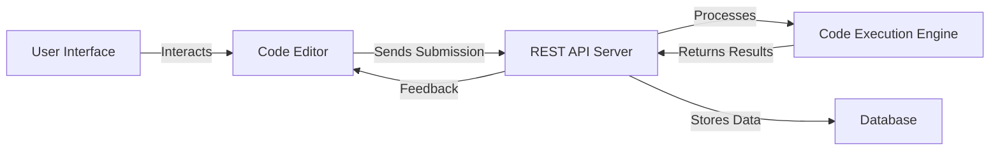

# CodeQuest

## Introduction

CodeQuest is an open-source project designed to offer a robust and interactive code challenge platform. It provides users with a smooth interface to attempt, submit, and validate coding solutions in real time. The system supports a variety of programming languages and offers granular feedback, making it ideal for learners, recruiters, and coding enthusiasts.

## Usage

To use CodeQuest, clone the repository and install the required dependencies. Once installed, start the development server to access the interactive coding environment. Users can select challenges, write code, and submit their solutions for instant evaluation.

- Clone the repo:  
  ```bash
  git clone https://github.com/gauravv-x/CodeQuest.git
  cd CodeQuest
  ```
- Install dependencies:  
  ```bash
  npm install
  ```
- Start the development server:  
  ```bash
  npm run dev
  ```
- Open your browser and visit `http://localhost:3000` to access the platform.

## Configuration

CodeQuest uses environment variables and configuration files to manage system behavior. Customize the `.env` file to set values such as API endpoints, database URIs, authentication keys, or third-party service credentials.

- Copy the example config:
  ```bash
  cp .env.example .env
  ```
- Edit `.env` and adjust settings as needed for your local or production environment.

## Features

- Interactive code editor with syntax highlighting.
- Real-time code execution and feedback.
- Multiple programming language support.
- Challenge selection with difficulty levels.
- User authentication and progress tracking.
- RESTful API for submissions and user management.
- Extensible test case and challenge management.
- Responsive UI for desktop and mobile devices.

## Requirements

Before installing, ensure your system meets these requirements:

- Node.js (v16 or above recommended)
- npm (v8 or above)
- Git
- (Optional) Docker, if you wish to deploy using containers

## Installation

Follow these steps to install and launch CodeQuest:

1. Clone the repository:
    ```bash
    git clone https://github.com/gauravv-x/CodeQuest.git
    cd CodeQuest
    ```
2. Install dependencies:
    ```bash
    npm install
    ```
3. Configure environment variables:
    ```bash
    cp .env.example .env
    # Edit .env as needed
    ```
4. Start the development server:
    ```bash
    npm run dev
    ```
5. Visit `http://localhost:3000` in your browser to use the platform.

## Contributing

Contributions are welcome! To contribute:

- Fork the repository and clone your fork.
- Create a new branch for your feature or bugfix.
- Make your changes, following the coding guidelines.
- Add or update tests to cover your changes.
- Commit your changes and push your branch.
- Open a pull request describing your changes.

Please read the `CONTRIBUTING.md` file for detailed guidelines.

## License

CodeQuest is licensed under the MIT License. You are free to use, modify, and distribute this software in compliance with the license terms.

---

## Project Architecture Overview

The following diagram illustrates the high-level structure of CodeQuest, showing the main modules and their interactions.



---

## API Endpoints

Below are interactive API documentation blocks for the core endpoints.

### Submit Code Solution (POST /api/submit)

```api
{
    "title": "Submit Code Solution",
    "description": "Submits user code for evaluation against challenge test cases.",
    "method": "POST",
    "baseUrl": "http://localhost:3000",
    "endpoint": "/api/submit",
    "headers": [
        {
            "key": "Authorization",
            "value": "Bearer <token>",
            "required": true
        },
        {
            "key": "Content-Type",
            "value": "application/json",
            "required": true
        }
    ],
    "queryParams": [],
    "pathParams": [],
    "bodyType": "json",
    "requestBody": "{\n  \"challengeId\": \"123\",\n  \"language\": \"javascript\",\n  \"code\": \"function solution() { return true; }\"\n}",
    "formData": [],
    "responses": {
        "200": {
            "description": "Submission successful, returns result and feedback.",
            "body": "{\n  \"success\": true,\n  \"output\": \"All test cases passed.\",\n  \"score\": 100\n}"
        },
        "400": {
            "description": "Bad request, missing parameters.",
            "body": "{\n  \"error\": \"Required fields missing\"\n}"
        }
    }
}
```

### Get Challenge Details (GET /api/challenge/:id)

```api
{
    "title": "Get Challenge Details",
    "description": "Retrieves detailed information about a specific coding challenge.",
    "method": "GET",
    "baseUrl": "http://localhost:3000",
    "endpoint": "/api/challenge/:id",
    "headers": [
        {
            "key": "Authorization",
            "value": "Bearer <token>",
            "required": true
        }
    ],
    "queryParams": [],
    "pathParams": [
        {
            "key": "id",
            "value": "Challenge ID",
            "required": true
        }
    ],
    "bodyType": "none",
    "requestBody": "",
    "formData": [],
    "responses": {
        "200": {
            "description": "Challenge details retrieved.",
            "body": "{\n  \"id\": \"123\",\n  \"title\": \"FizzBuzz\",\n  \"description\": \"Write a program...\"\n}"
        },
        "404": {
            "description": "Challenge not found.",
            "body": "{\n  \"error\": \"Challenge not found\"\n}"
        }
    }
}
```

### User Login (POST /api/auth/login)

```api
{
    "title": "User Login",
    "description": "Authenticates a user and returns a JWT token.",
    "method": "POST",
    "baseUrl": "http://localhost:3000",
    "endpoint": "/api/auth/login",
    "headers": [
        {
            "key": "Content-Type",
            "value": "application/json",
            "required": true
        }
    ],
    "queryParams": [],
    "pathParams": [],
    "bodyType": "json",
    "requestBody": "{\n  \"email\": \"user@example.com\",\n  \"password\": \"password123\"\n}",
    "formData": [],
    "responses": {
        "200": {
            "description": "Login successful.",
            "body": "{\n  \"token\": \"<jwt-token>\",\n  \"user\": { \"id\": \"u123\", \"name\": \"Alice\" }\n}"
        },
        "401": {
            "description": "Invalid credentials.",
            "body": "{\n  \"error\": \"Invalid email or password\"\n}"
        }
    }
}
```

---

## Support

For issues, feature requests, or questions, please open an issue in the GitHub repository.

---

```card
{
    "title": "MIT Licensed",
    "content": "You can freely use, modify, and distribute CodeQuest under the MIT License."
}
```
